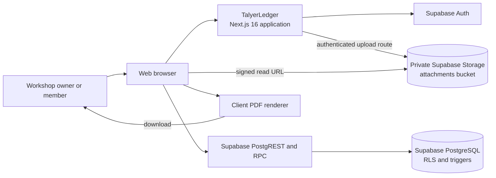
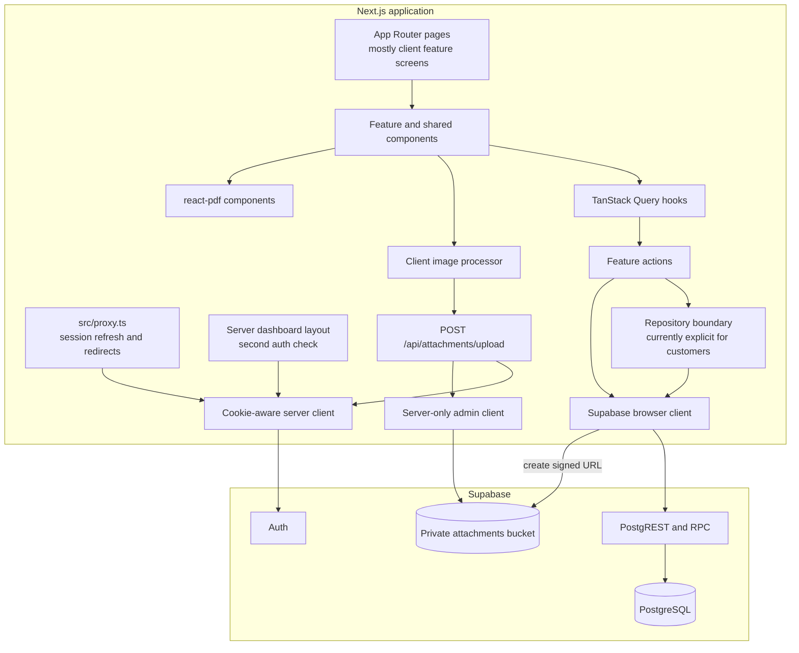
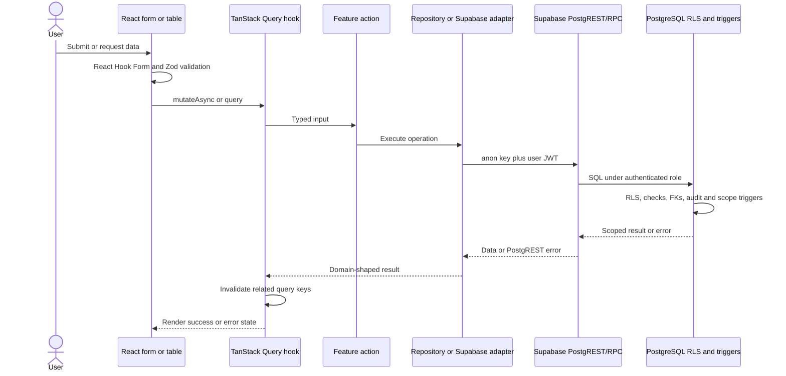
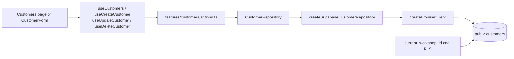
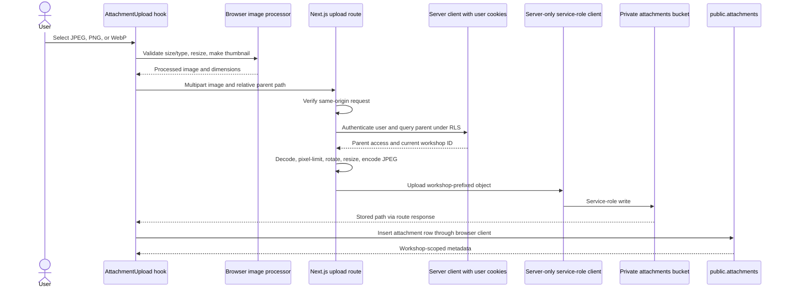

# TalyerLedger Architecture

## Scope and authority

This document describes the current repository as of 2026-07-23. The executable migrations under `src/db/migrations`, application code under `src`, and tests are the primary evidence. Older root-level architecture reports describe earlier phases and are not authoritative for the `00009` tenant model.

Migration `00009` passes the repository's PGlite tests. It was not applied to a live Supabase project during this documentation session, so any remote deployment must begin with the preflight in [migration-guide.md](migration-guide.md).

## System context

The normal record path is browser-to-Supabase through the anon key and the authenticated user's JWT. The server-only exception is object upload: the Next.js route verifies the user and parent record, then writes the normalized JPEG with the service-role key.

## Runtime components

Most feature `actions.ts` modules are browser-callable data functions, not Next.js Server Actions. They create the browser Supabase client directly. Customer access has an explicit `CustomerRepository`; other features currently combine use-case and Supabase access in `actions.ts`.

## Primary layers

| Layer               | Location                               | Responsibility                                                                                                                   |
| ------------------- | -------------------------------------- | -------------------------------------------------------------------------------------------------------------------------------- |
| Routes and layouts  | `src/app`                              | URL structure, authentication layouts, page composition, upload and auth callback handlers.                                      |
| Feature UI          | `src/features/*/components`            | Forms, lists, details, galleries, pickers, and feature interactions.                                                             |
| Server-state hooks  | `src/features/*/hooks`                 | TanStack Query reads/mutations and cache invalidation.                                                                           |
| Actions/use cases   | `src/features/*/actions.ts`            | Supabase queries, record orchestration, status checks, and post-write recalculation.                                             |
| Repository          | `src/features/customers/repository.ts` | Injectable Supabase implementation for customer persistence and unit testing. This pattern is not yet applied to every feature.  |
| Shared domain logic | `src/lib`                              | Financial calculations, auth routing, errors, logging, environment validation, security checks, storage, and Supabase factories. |
| Database            | `src/db/migrations`                    | PostgreSQL schema, integrity checks, RLS, audit triggers, storage policy, and RPC functions.                                     |
| Tests               | colocated, `src/db/tests`, `e2e`       | Unit/component, repository, migration/RLS, and Playwright smoke tests.                                                           |

## Record data flow

Zod validates form input before a mutation, but database constraints and RLS remain authoritative. Supabase response data is mostly cast to manually maintained TypeScript interfaces; there is no checked-in generated `database.types.ts` in the current repository.

## Representative customer flow

The customer feature is the clearest complete UI-to-repository example.

Example create path:

1. `CustomerForm` validates `customerSchema` and converts empty optional fields to `null`.
2. `useCreateCustomer()` calls `createCustomer()` and invalidates `['customers']` after success.
3. `createCustomer()` constructs the Supabase repository and calls `create()`.
4. The repository issues `client.from('customers').insert(input).select().single()`.
5. PostgreSQL supplies `workshop_id`, checks active membership, sets audit fields, and applies workshop-scoped RLS.
6. The returned row repopulates customer screens through the invalidated query.

Customer list reads explicitly select active rows, include a count of active vehicles, order by name, and cap results at 100. RLS independently prevents cross-workshop rows from being returned.

## Attachment upload data flow

Security properties:

- Browser code never receives `SUPABASE_SERVICE_ROLE_KEY`.
- The route only accepts a constrained parent path for `vehicle`, `work_order`, or `line_item` and verifies the parent through user RLS.
- Stored paths start with the verified workshop UUID; storage SELECT policy checks that segment against membership.
- Source images are decoded and re-encoded as JPEG server-side. The bucket itself accepts only JPEG and is limited to 10 MiB.
- Reads use signed URLs.

Current consistency limitation: object upload completes before metadata insertion. Failure between those steps leaves an object without metadata. Soft-deleting metadata also leaves the underlying object because the current storage service has no delete operation.

## Authentication flow

1. `src/proxy.ts` invokes `updateSession()` for non-static requests.
2. The middleware client refreshes cookie state and calls `auth.getUser()`.
3. Unauthenticated protected requests are redirected to `/login` with a sanitized same-origin `next` path.
4. Authenticated users visiting `/login` or `/register` are redirected to the sanitized return path.
5. The dashboard server layout repeats `auth.getUser()` before rendering the shell.
6. Sign-up is blocked in both route classification and the auth action unless `NEXT_PUBLIC_ALLOW_SIGN_UP=true`.
7. After Supabase creates an auth user, migration `00009`'s auth trigger provisions an isolated workshop, owner membership, and settings row.

## Tenant and authorization model

- `workshops` is the tenant root. One auth user can own at most one workshop because `owner_id` is unique.
- `workshop_members` maps users to workshops with `owner` or `member` role and allows one active owner per workshop.
- All operational tables carry non-null `workshop_id`; defaults and triggers keep it aligned with the authenticated context.
- Composite foreign keys prevent a row from referencing a parent in another workshop.
- Standard table SELECT policies expose only active rows to members. INSERT and UPDATE require membership and the current workshop. No client hard-delete policies exist.
- Shop settings writes and workshop updates require owner membership.
- `work_order_number_counters` is inaccessible directly through RLS; `next_work_order_number()` is the authenticated interface.
- The service role bypasses RLS and is therefore confined to server-only code. The upload route uses it only after user-scoped authorization.

There is no current workshop-switching context in the UI. A user with multiple memberships can read rows allowed by RLS, but normal inserts and updates are constrained to the single workshop selected by `current_workshop_id()`.

## Database responsibilities

PostgreSQL owns the controls that must survive alternate clients:

- Workshop-scoped RLS and immutable tenant assignment.
- Cross-workshop composite relationships.
- Work-order transition validation and status activity events.
- Atomic daily work-order number allocation.
- Positive/non-negative financial constraints and discount bounds.
- Attachment-parent validation for the polymorphic association.
- Audit actor and timestamp triggers.
- Soft-delete/restore RPCs that can cross the active-row SELECT boundary safely.
- Private storage bucket configuration and workshop-scoped read policy.

Application code owns form validation, cent-based calculations, payment-status recalculation, cache invalidation, and user-facing workflows. Payment status is not maintained by a database trigger; writes outside application flows could make it stale.

## Financial architecture

`src/lib/financial-calculations.ts` is the canonical application calculator. It rounds to integer cents, derives gross from quantity and unit price rather than trusting `line_total`, caps discounts at their base, and derives balance and payment state.

The schema still stores `line_total` and `work_orders.payment_status`. Actions update those fields, so they are denormalized values with drift risk if records are changed outside the supported actions.

## Deployment view

| Concern               | Current implementation                                                                                  |
| --------------------- | ------------------------------------------------------------------------------------------------------- |
| Web runtime           | Next.js 16 and React 19; repository scripts use webpack for development and build.                      |
| Database/Auth/Storage | Supabase PostgreSQL, Auth, PostgREST/RPC, and private Storage.                                          |
| Browser credentials   | Public Supabase URL and anon key only.                                                                  |
| Server credential     | Optional at process boot, but required when secure uploads are used.                                    |
| State                 | TanStack Query for server state, React Hook Form for forms, local component state for interaction.      |
| Documents             | `@react-pdf/renderer` in the browser.                                                                   |
| CI                    | GitHub Actions runs lint with zero warnings, typecheck, Vitest, audit, and production build on Node 22. |

The repository does not contain a Supabase CLI `config.toml` or standard `supabase/migrations` directory. Deployment and migration history must therefore be managed explicitly; see [migration-guide.md](migration-guide.md).

## Verification and limitations

Local verification performed on 2026-07-26:

- `npm run db:test`: 9/9 migration tests passed.
- Complete Vitest suite: 50/50 tests passed across 9 files.
- Playwright auth-foundation smoke: desktop and mobile projects passed.

PGlite creates simplified `auth` and `storage` schemas and proves the clean SQL chain plus selected RLS behavior. It does not prove compatibility with a drifted remote schema, Supabase platform internals, a live service-role upload, or production auth configuration.

Important architectural gaps:

- Only customers currently have an injectable repository interface; other feature actions use the Supabase client directly.
- Work-order header plus line-item create/update/copy is atomic. Package plus package-item and object plus metadata writes remain split workflows.
- UI and database use the same forward work-order sequence, with database enforcement and explicit voiding support.
- Atomic work-order updates use `version` as an optimistic concurrency precondition.
- Private attachments are owner-only; workshop/customer classifications are member-readable.
- Customer attachment parents are supported in TypeScript, database validation, and upload routing.
- The legacy `photos` table remains tenant-scoped but is not the current evidence model.
