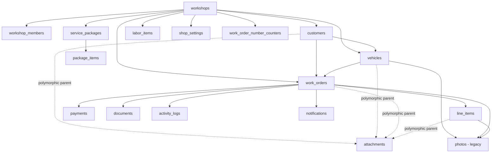
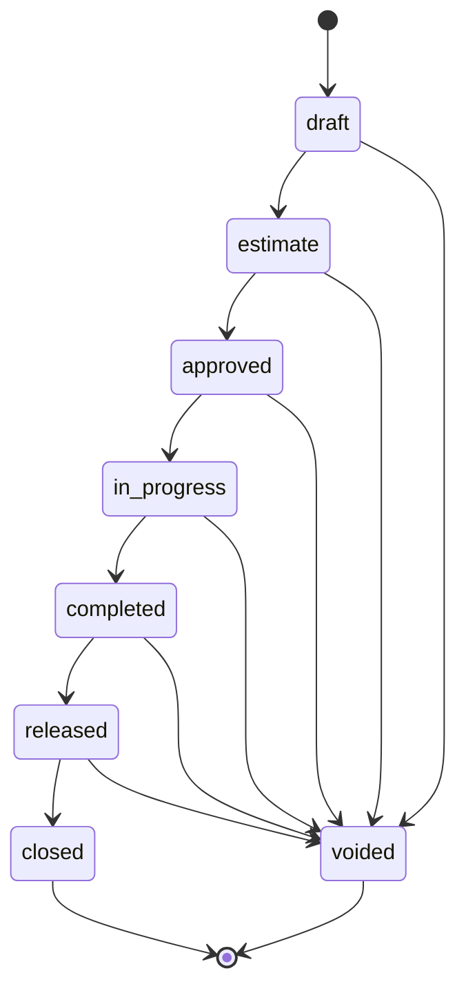
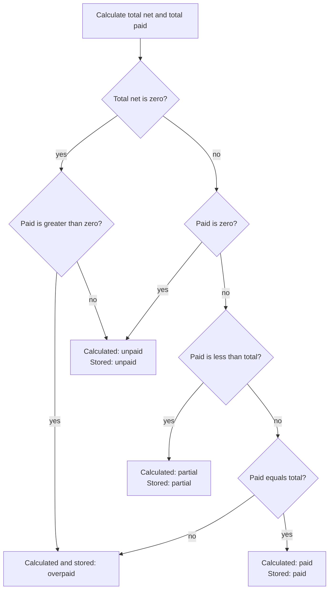

# Database Schema

## Baseline

The current repository schema is the ordered result of migrations `00001` through `00009` in `src/db/migrations`. Migration `00005` renames `jobs` to `work_orders`; the current schema has no intended `public.jobs` table.

The full chain passes `src/db/tests/migrations.test.ts` in PGlite. Migration `00009` was not applied to a live Supabase project in this documentation session. A remote database can differ from repository history and must pass the preflight in [migration-guide.md](migration-guide.md).

## Schema domains

| Domain                | Tables                                                        |
| --------------------- | ------------------------------------------------------------- |
| Tenancy and access    | `workshops`, `workshop_members`                               |
| Customer and vehicle  | `customers`, `vehicles`                                       |
| Work execution        | `work_orders`, `line_items`, `activity_logs`, `notifications` |
| Finance and documents | `payments`, `documents`, `shop_settings`                      |
| Reusable catalog      | `labor_items`, `service_packages`, `package_items`            |
| Evidence              | `attachments`, legacy `photos`                                |
| Number allocation     | `work_order_number_counters`                                  |

Supabase-owned `auth.users`, `storage.buckets`, and `storage.objects` are dependencies, not application-owned public tables.

## Current PostgreSQL types

| Type or checked text         | Values                                                                                      |
| ---------------------------- | ------------------------------------------------------------------------------------------- |
| `work_order_status` enum     | `draft`, `estimate`, `approved`, `in_progress`, `completed`, `released`, `closed`, `voided` |
| `line_item_category` enum    | `fluids`, `parts`, `accessories`, `labor`, `other`                                          |
| `currency_code` enum         | `PHP`, `USD`, `EUR`                                                                         |
| `photo_type` enum            | `before`, `after`, `damage`, `vehicle_overview`, `odometer`                                 |
| `work_orders.payment_status` | `unpaid`, `partial`, `paid`, `overpaid`                                                     |
| `payments.payment_type`      | `deposit`, `regular`                                                                        |
| `work_orders.payer_type`     | `customer`, `insurance`, `both`                                                             |
| Discount type                | `amount`, `percent`, or `NULL`                                                              |

`job_status` was an intermediate enum and is dropped by migration `00006`.

## Tenancy model

`workshops` is the tenant root. Every application-owned operational table carries a non-null `workshop_id`, except `workshop_members` and `work_order_number_counters`, where it is part of a composite primary key.

Migration `00009` enforces tenant integrity at several layers:

1. `workshop_id` defaults to `current_workshop_id()` for authenticated inserts.
2. `enforce_workshop_scope()` rejects unauthorized inserts and makes scope immutable on update.
3. RLS limits active records to workshop members.
4. Composite foreign keys prevent cross-workshop customer, vehicle, work-order, package, and child references.
5. `validate_attachment_parent()` checks the polymorphic attachment parent and workshop.

One user may have multiple memberships, but the application has no workshop selector. `current_workshop_id()` returns one active membership, preferring an owned workshop and then the earliest membership.

## Relationship overview



See [erd.md](erd.md) for cardinalities and [data-dictionary.md](data-dictionary.md) for columns.

## Work-order status

The database trigger, not the UI, is the final transition guard.



Rules implemented by `enforce_work_order_transition()`:

- `closed` and `voided` are terminal.
- Every accepted update increments `version`, even when status does not change.
- A status change inserts an `activity_logs` row with event type `status_changed` and `from`/`to` metadata.
- The client `STATUS_TRANSITIONS` map exposes the same forward chain `draft -> estimate -> approved -> in_progress -> completed -> released -> closed`.
- New rows must begin in `draft`; valid nonterminal states may also transition to `voided`.

Migration `00006` maps old statuses as follows:

| Old status              | Current status       | Initial payment status |
| ----------------------- | -------------------- | ---------------------- |
| `invoiced`              | `completed`          | `unpaid`               |
| `partially_paid`        | `completed`          | `partial`              |
| `paid`                  | `released`           | `paid`                 |
| Other retained statuses | Same semantic status | `unpaid`               |

## Payment status

Repair status and payment status are independent. Application calculations derive payment status from active payments and calculated work-order net total.



Payments cannot be negative and have no refund payment type. Database triggers recalculate payment status after line-item, payment, and overall-discount changes. A separate trigger rejects direct authenticated writes to `payment_status`.

## Financial integrity

Migration `00009` validates existing rows and then enforces:

- `line_items.quantity > 0`.
- `line_items.unit_price >= 0` and `line_total >= 0`.
- A trigger stores `line_total = round(quantity * unit_price, 2)` and a check constraint verifies the invariant.
- Amount discounts are non-negative; percent discounts are between 0 and 100.
- A missing discount type requires discount value zero.
- `payments.amount > 0`.
- Catalog/package prices are non-negative and package-item quantity is positive.

The application calculates with rounded integer cents. `line_total` is stored as gross quantity times unit price, while displays recompute gross and net rather than trusting a potentially stale value.

## Work-order numbering

`next_work_order_number()` allocates numbers atomically through `work_order_number_counters`:

```text
YY-MMDD-000001
```

- Date is evaluated in `workshops.timezone`, default `Asia/Manila`.
- The counter key is `(workshop_id, counter_date)`.
- `INSERT ... ON CONFLICT DO UPDATE` serializes increments.
- The unique work-order key is `(workshop_id, estimate_no)`.
- New numbers must match `YY-MMDD-000001`; a trigger prevents later updates to `estimate_no`.
- Normal authenticated inserts are denied. Create/copy RPCs allocate the number and write the work order transactionally.
- Counters are seeded from existing numbers already using the six-digit format.
- Counter rows have forced RLS and no direct client policy; authenticated callers use the security-definer RPC.
- Allocated values are intentionally not reused, so gaps are valid.

## Attachment and storage model

`attachments` is the current evidence model. It uses `parent_type` plus `parent_id`; a trigger validates active parent existence and matching workshop. Database parent types are `customer`, `vehicle`, `work_order`, and `line_item`.

The secure upload route supports customer, vehicle, work-order, and line-item parents. It accepts JPEG/PNG/WebP sources, normalizes stored objects to JPEG, prefixes paths with `workshop_id`, and writes through a server-only service-role client. The route accepts processed multipart bodies up to 4 MiB to remain below the hosting function's request limit; the client rejects raw sources over 10 MiB.

The `attachments` storage bucket is configured as:

| Setting             | Value                                                                                    |
| ------------------- | ---------------------------------------------------------------------------------------- |
| Public              | `false`                                                                                  |
| Maximum object size | 10,485,760 bytes (10 MiB)                                                                |
| Allowed MIME types  | `image/jpeg`                                                                             |
| Authenticated read  | Path's first folder must be a UUID for a workshop in which the user is an active member. |
| Authenticated write | No storage write policy; writes are server-only through `service_role`.                  |

Metadata `visibility` has values `private`, `workshop`, and `customer`. Private metadata/objects are owner-only; workshop and customer records are readable by active workshop members. Current PDF code selects only `customer` attachments. Unique path indexes and the attachment trigger bind metadata paths to the workshop and active parent.

## Legacy `photos`

The `photos` table is retained from migrations `00001` and `00003`. Migration `00005` renamed its `job_id` column to `work_order_id`, and migration `00009` added workshop scope and active-row RLS.

New gallery/upload code uses `attachments`, not `photos`. Migration `00009` removes the old broad storage policies named for photos but does not drop the `photos` table, a legacy `photos` bucket, or existing objects. Any cleanup or data migration must be a separate, backed-up, target-specific operation.

## RLS policy matrix

| Object group | SELECT | INSERT | UPDATE | DELETE |
| --- | --- | --- | --- | --- |
| Standard scoped tables | Active member rows | Active row in current member workshop | Active row remains active/current and scope-immutable | No client policy; use allowlisted RPC |
| `work_orders` | Active member rows | No direct policy; use atomic create/copy RPC | Active member row plus status/number/payment/version triggers | No client policy |
| Work-order/package children | Active member row only while operational parent is active | Active current-workshop parent required | Active current-workshop parent required | No client policy |
| `attachments` | Active parent/member; private is owner-only | Active parent/current member; private is owner-only; exact unique path required | Same active parent/visibility/path boundary | No client policy |
| `shop_settings` | Active member rows | Current workshop owner | Active current workshop owner | No client policy |
| `activity_logs` | Workshop members | Current workshop member | No client policy | No client policy |
| `workshops` / `workshop_members` | Member/owner-scoped | Provisioning or owner policy | Owner policy plus immutable ownership trigger | No client policy |
| Counters and `storage.objects` writes | No direct counter access; exact metadata-backed Storage reads | Security-definer allocator / server-only Storage role | Server-only | Server-only |

All public application tables have RLS enabled; migration `00009` forces RLS on the tenant-scoped tables it configures. Soft deletion and restoration use allowlisted security-definer RPCs because ordinary SELECT policies hide deleted rows.

## Audit and deletion behavior

- Audit triggers populate `created_by`, `updated_by`, and `updated_at` where those columns exist.
- Under an authenticated JWT, the audit actor is forced to `auth.uid()`. Trusted migration/service contexts may supply an actor.
- Standard records are soft-deleted by setting `deleted_at`; hard DELETE is unavailable to authenticated application clients.
- `activity_logs` is append-oriented and has no update/delete client policy or `deleted_at`.
- `workshop_members` can be marked deleted through privileged/database operations, but no generic soft-delete RPC or current UI manages memberships.
- Soft-deleting attachment metadata does not delete its storage object.

## Migration and rollback implications

The current schema includes lossy transformations: table/column renames, status mapping, attachment column replacement, tenant ownership backfill, and stricter financial checks. Commented down-migration snippets in early files are guidance, not a verified end-to-end rollback.

For migration `00009`, retain workshop IDs and ownership assignments during any forward fix. Do not restore the old global authenticated RLS policies. A full rollback requires a verified pre-migration backup and coordinated application/database recovery. See [migration-guide.md](migration-guide.md#rollback-and-recovery).
