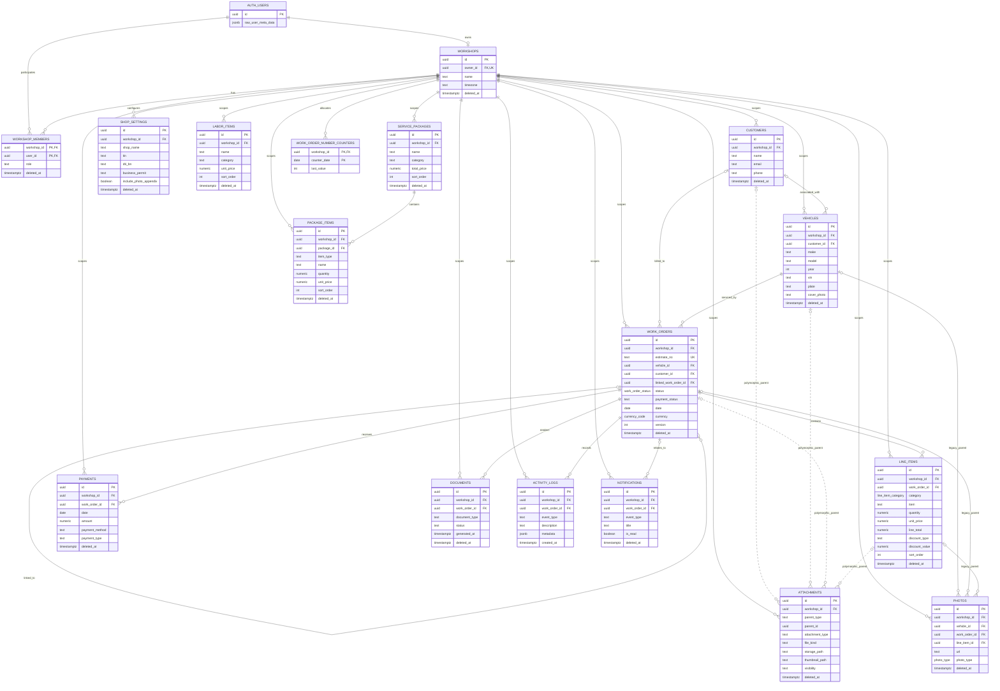

# Entity Relationship Diagram

## Current public schema

## Interpretation notes

- `AUTH_USERS` represents Supabase-owned `auth.users`, not a public application table.
- All solid tenant relationships originate from `workshops`. Operational rows have non-null `workshop_id` and workshop-scoped RLS.
- Customer links on vehicles and work orders are optional. Every work order requires a vehicle.
- A work order can link to another work order in the same workshop.
- `attachments` uses a polymorphic relationship. The dotted lines are conceptual, not physical foreign keys. `validate_attachment_parent()` checks active parent existence and workshop equality for `customer`, `vehicle`, `work_order`, and `line_item`.
- Current TypeScript, database, and upload routing support customer, vehicle, work-order, and line-item attachment parents.
- `photos` is the legacy evidence table. Its three parent FKs are independently nullable, and the schema does not require exactly one parent. New application galleries use `attachments`.
- `shop_settings` can contain historical soft-deleted rows; a partial unique index allows only one active row per workshop.
- Work-order number uniqueness is composite: `(workshop_id, estimate_no)`. Counter identity is `(workshop_id, counter_date)`.
- Several original single-column FKs remain alongside newer composite workshop FKs. The composite constraints are what prevent cross-workshop references.

Column-level definitions are in [data-dictionary.md](data-dictionary.md); status and payment flows are in [database-schema.md](database-schema.md).
